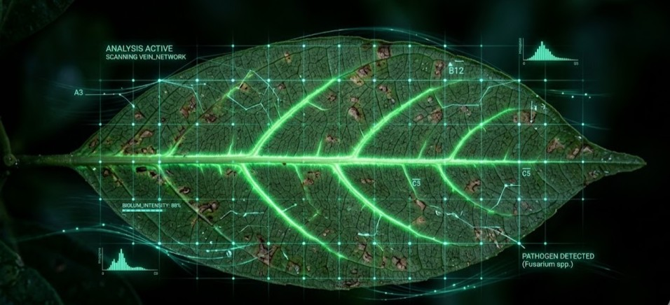
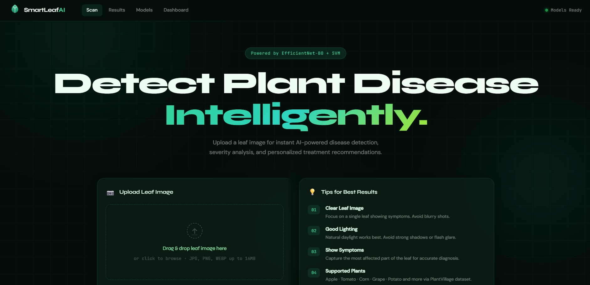
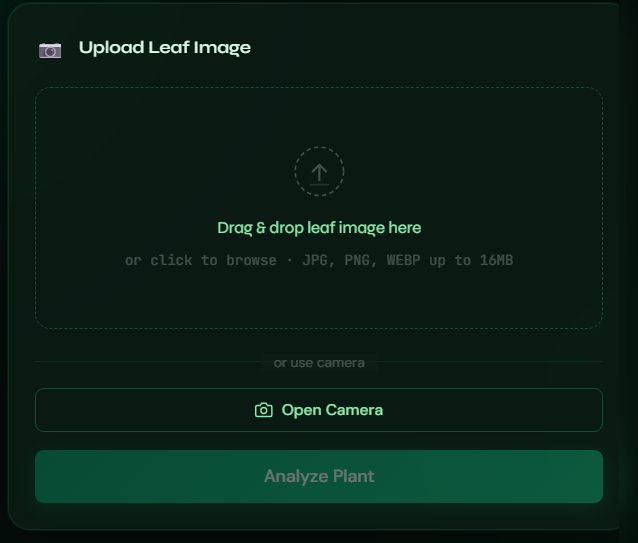
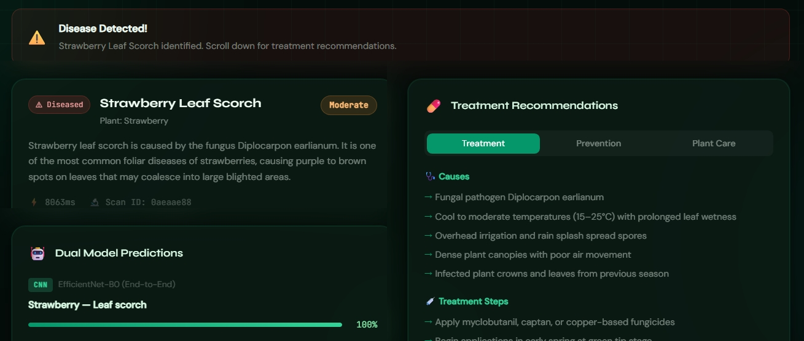

<div align="center">



# SmartLeaf AI
# Mohamed Hassanein | Shady Mohammed | Yehia Haitham

### Intelligent Plant Disease Detection System

[](https://python.org)
[](https://tensorflow.org)
[](https://flask.palletsprojects.com)
[](https://scikit-learn.org)


</div>

---

## Screenshots

<div align="center">

### Homepage


### Upload & Scan


### Results & Treatment


</div>

---

## Features

-  **Dual AI Prediction** — EfficientNet-B0 CNN and SVM run simultaneously on every scan
-  **98.67% Accuracy** — fine-tuned EfficientNet-B0 on 54,000+ PlantVillage images
-  **Treatment Recommendations** — causes, treatment steps, prevention, and plant care for all 38 disease classes
-  **Disease Severity Estimation** — OpenCV HSV color analysis estimates mild / moderate / severe
-  **Model Comparison Dashboard** — side-by-side CNN vs SVM metrics with live charts
-  **Smart Farmer Dashboard** — scan history, statistics, and disease distribution tracking

---

## AI Approaches

| | Approach 1 | Approach 2 |
|---|---|---|
| **Name** | EfficientNet-B0 + SVM | EfficientNet-B0 End-to-End |
| **Method** | Frozen feature extractor → SVM (RBF) | Fine-tuned CNN classifier |
| **Accuracy** | 97.63% | 98.67% |
| **F1-Score** | 97.62% | 98.67% |
| **Train Time** | ~51 min (CPU) | ~4 hours (GPU) |
| **Inference** | ~45ms | ~28ms |

Both models run on every prediction, and their outputs are shown side by side on the results page.

---

## Architecture

```
SmartLeaf-AI/
├── backend/
│   ├── app.py                  # Flask REST API
│   ├── predictor.py            # CNN + SVM inference pipeline
│   └── treatment_data.json     # 38 disease treatment entries
├── frontend/
│   ├── index.html              # Single-page web app
│   ├── css/styles.css          # Dark bioluminescent theme
│   └── js/script.js            # Upload, camera, results rendering
├── notebooks/
│   └── train.ipynb             # Full training pipeline notebook
├── models/                     # Saved model files (after training)
├── results/                    # Training plots and metrics
├── dataset/                    # PlantVillage dataset (not included)
└── requirements.txt
```

### API Endpoints

| Method | Route | Description |
|--------|-------|-------------|
| GET | `/` | Serve frontend SPA |
| POST | `/api/predict` | Run CNN + SVM prediction on uploaded image |
| GET | `/api/compare` | Model comparison metrics |
| GET | `/api/stats` | Dashboard statistics and scan history |
| GET | `/api/treatments` | List all 38 disease treatments |
| GET | `/api/treatments/<key>` | Get treatment for specific disease |
| GET | `/api/health` | Server and model status |

---

## Dataset

**PlantVillage Dataset** — [Download from Kaggle](https://www.kaggle.com/datasets/abdallahalidev/plantvillage-dataset)

## Quick Start

### Prerequisites
- Python 3.10
- NVIDIA GPU recommended (CPU works but CNN training takes ~6–10 hours)
- [Miniconda](https://docs.anaconda.com/miniconda/) for GPU setup

### 1. Create and activate environment
```bash
conda create -n smartleaf python=3.10 -y
conda activate smartleaf
```

### 2. Install Python dependencies
```bash
pip install tensorflow==2.10.0 scikit-learn numpy opencv-python Pillow Flask flask-cors pandas matplotlib seaborn tqdm python-dotenv jupyter
```

### 3. Download and prepare dataset
Download PlantVillage from Kaggle and place the `color/` folder at:
```
dataset/plantvillage dataset/color/
```

### 4. Train the models
Open `notebooks/train.ipynb` in VS Code or Jupyter, set your `DATA_DIR` in Section 2, and run all cells.

### 5. Start the backend
```bash
cd backend
python app.py
```

## Results

### Model Performance

| Metric | CNN | SVM |
|--------|-----|-----|
| Accuracy | **98.67%** | 97.63% |
| Precision | **98.67%** | 97.63% |
| Recall | **98.67%** | 97.63% |
| F1-Score | **98.67%** | 97.62% |
| Training Time | 14,449s | 3,092s |

### Key Findings
- End-to-end CNN fine-tuning outperforms feature extraction + SVM by **~1%** in accuracy
- SVM training is **~4.7x faster** than CNN while remaining highly competitive
- Both models exceed the 90% accuracy target specified in the SRS

---

## Tech Stack

| Layer | Technology |
|-------|-----------|
| **Frontend** | HTML5, CSS3, JavaScript (Vanilla) |
| **Backend** | Python, Flask, Flask-CORS |
| **Deep Learning** | TensorFlow 2.10, Keras, EfficientNet-B0 |
| **Machine Learning** | scikit-learn, SVM (RBF kernel) |
| **Computer Vision** | OpenCV (severity estimation) |
| **Data Processing** | NumPy, Pandas, Pillow |
| **Visualization** | Matplotlib, Seaborn |
| **Dataset** | PlantVillage (Kaggle) |
